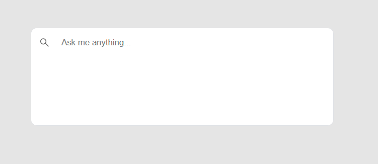

This is a sample project to show case how to use Azure OpenAI and Azure Search to Search your own data.


# Azure Functions 


### [TranscriptUploadedBlobTrigger](/src/csharp/function/functions/TranscriptUploadedBlobTrigger.cs)
This function is triggered by an blob upload. It chunks down the document and lets Azure OpenAI create 
embedding vectors for each chunk. Those are than written in an Azure Search Index. The index in which the data gets stored is determined by the files directory.

### [FileUpload](/src/csharp/function/functions/FileUpload.cs)
Extracts a file and a directory name from a post request with form-data and stores the file on a storage account within the directory. 

### [Ask](/src/csharp/function/functions/Ask.cs)
As the name says, Ask endpoint. If requires an index name and a question. It will than use Azure OpenAI to get an embedding vector and use this to query data from Azure Search. At the end it will than use Azure OpenAI again to phrase an answer.

# React Frontend
Besides the Azure function the project contains also a simple ui to ask questions.



Chat history is right now not supported. May be added later.

# deploy azure resource

to deploy the azure resources use [deploy.ps1](/eng/deploy.ps1)

```
az login
az account set --s subscriptionId
.\deploy.ps1
```

# To run local

Get the necessary data from the azure resources and add them to the either local.setting.json or into local project secrets.

## Project secrets

recommended using secrets: [.net secrets extension](https://marketplace.visualstudio.com/items?itemName=adrianwilczynski.user-secrets)
and the following secrets

```
{
    "AzureWebJobsStorage": "<Storage account connection string>",
    "AZURE_SEARCH_ENDPOINT":"<azure search endpoint>",
    "AZURE_SEARCH_KEY":"<azure search key>",
    "OPENAI_KEY":"<open ai key>",
    "OPENAI_ENDPOINT":"<open ai endpoint>",
    "ML_MODEL_NAME": "<Azure ML model>",
    "ML_AUTHORIZATION_KEY": "<model endpoint key>",
    "ML_ENDPOINT": "<model endpoint>",
    "EMBEDDING_MODEL_NAME": "embedding" ,
    "CHAT_MODEL_NAME": "chat" 
}
```

## Local setting

```
{
  "IsEncrypted": false,
  "Values": {
    "FUNCTIONS_WORKER_RUNTIME": "dotnet",
    "AzureWebJobsStorage": "<Storage account connection string>",
    "AZURE_SEARCH_ENDPOINT":"<azure search endpoint>",
    "AZURE_SEARCH_KEY":"<azure search key>",
    "OPENAI_KEY":"<open ai key>",
    "OPENAI_ENDPOINT":"<open ai endpoint>",
    "ML_MODEL_NAME": "<Azure ML model>",
    "ML_AUTHORIZATION_KEY": "<model endpoint key>",
    "ML_ENDPOINT": "<model endpoint>",
    "EMBEDDING_MODEL_NAME": "embedding",
    "CHAT_MODEL_NAME": "chat" 
  }
}
```


# Start front end
Go to /src/react/transcript-chat-bot

```
npm install
npm run dev
```